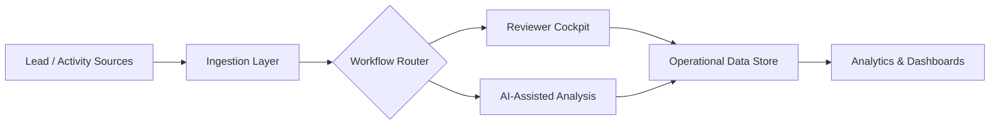
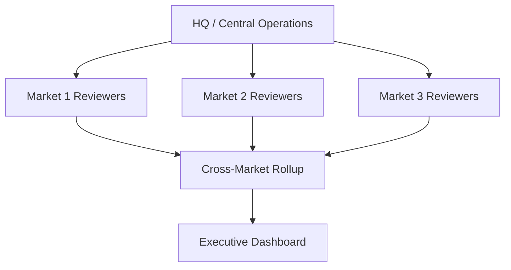

# Operations Intelligence Platform

Operational intelligence and reviewer workflow platform for distributed lead and operations management.

> **Positioning:** Enterprise-grade operational visibility — turning fragmented activity into accountable, standardized, AI-assisted operational decisions.
---

## Overview

A platform concept for operational visibility across distributed teams: dashboards, reviewer routing, analytics, and AI-assisted operational analysis that standardize how work is reviewed and scaled.

## Problem

As operations scale across people, regions, and markets, visibility and accountability degrade. Decisions get made on stale or fragmented data, and review quality becomes inconsistent.

## Operational Challenges

- Limited operational visibility across distributed teams
- Inconsistent reviewer accountability
- Fragmented lead and activity data
- No standardized process as complexity scales
- Reactive rather than proactive operational analysis

## Solution

A reviewer-and-analytics layer that routes work intelligently, standardizes review, and surfaces operational intelligence — with AI assisting analysis while humans retain accountability.

## Features

- Operational dashboards
- Reviewer systems & routing
- Analytics flows
- Workflow routing
- Market scaling concepts
- AI-assisted operational analysis

## Architecture

See [`docs/architecture.md`](docs/architecture.md) for full system, reviewer workflow, and multi-market scaling diagrams.

## Workflow Example

1. New lead/activity enters the pipeline.
2. Workflow routing assigns it to the appropriate reviewer.
3. AI-assisted analysis flags anomalies and surfaces priorities.
4. Reviewer accountability is tracked and reported.
5. Dashboards give leadership visibility across markets.

## Tech Stack

- Next.js / TypeScript
- Supabase
- Analytics & dashboard layer
- OpenAI APIs

## Screenshots

Reviewer cockpit and multi-market rollup visualizations are maintained as Mermaid diagrams in [`docs/architecture.md`](docs/architecture.md). Example: multi-market scaling.

## Lessons Learned

Visibility without accountability doesn't change outcomes. The platform's value comes from pairing operational intelligence with clear reviewer ownership.
