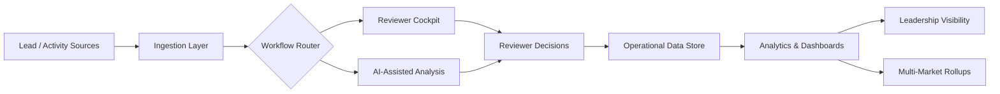
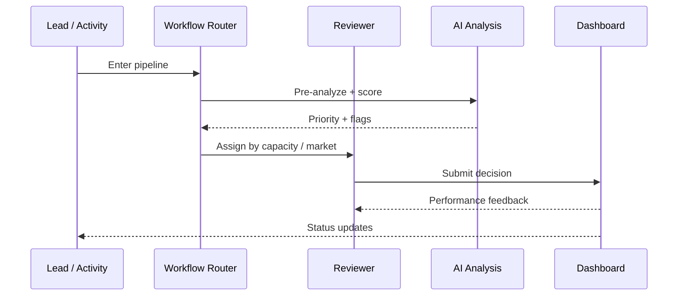
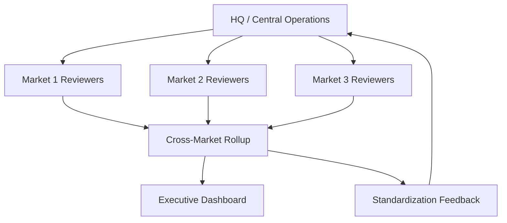
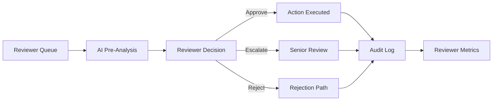

# Operations Intelligence Platform — Architecture

## System Architecture

```mermaid
flowchart LR
    A[Lead / Activity Sources] --> B[Ingestion Layer]
    B --> C{Workflow Router}
    C --> D[Reviewer Cockpit]
    C --> E[AI-Assisted Analysis]
    D --> F[Reviewer Decisions]
    E --> F
    F --> G[Operational Data Store]
    G --> H[Analytics & Dashboards]
    H --> I[Leadership Visibility]
    H --> J[Multi-Market Rollups]
```

## Reviewer Workflow & Accountability

```mermaid
sequenceDiagram
    participant Lead as Lead / Activity
    participant Router as Workflow Router
    participant Reviewer
    participant AI as AI Analysis
    participant Dash as Dashboard

    Lead->>Router: Enter pipeline
    Router->>AI: Pre-analyze + score
    AI-->>Router: Priority + flags
    Router->>Reviewer: Assign by capacity / market
    Reviewer->>Dash: Submit decision
    Dash-->>Reviewer: Performance feedback
    Dash-->>Lead: Status updates
```

## Multi-Market Scaling

```mermaid
flowchart TB
    HQ[HQ / Central Operations] --> M1[Market 1 Reviewers]
    HQ --> M2[Market 2 Reviewers]
    HQ --> M3[Market 3 Reviewers]
    M1 --> Roll[Cross-Market Rollup]
    M2 --> Roll
    M3 --> Roll
    Roll --> Exec[Executive Dashboard]
    Roll --> Std[Standardization Feedback]
    Std --> HQ
```

## Reviewer Cockpit Concept

```mermaid
flowchart LR
    Q[Reviewer Queue] --> A1[AI Pre-Analysis]
    A1 --> R[Reviewer Decision]
    R -->|Approve| OK[Action Executed]
    R -->|Escalate| Esc[Senior Review]
    R -->|Reject| Rej[Rejection Path]
    OK --> Log[Audit Log]
    Esc --> Log
    Rej --> Log
    Log --> Metrics[Reviewer Metrics]
```
